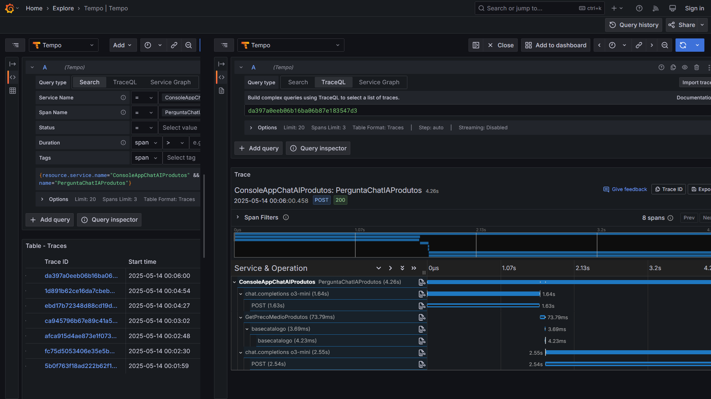
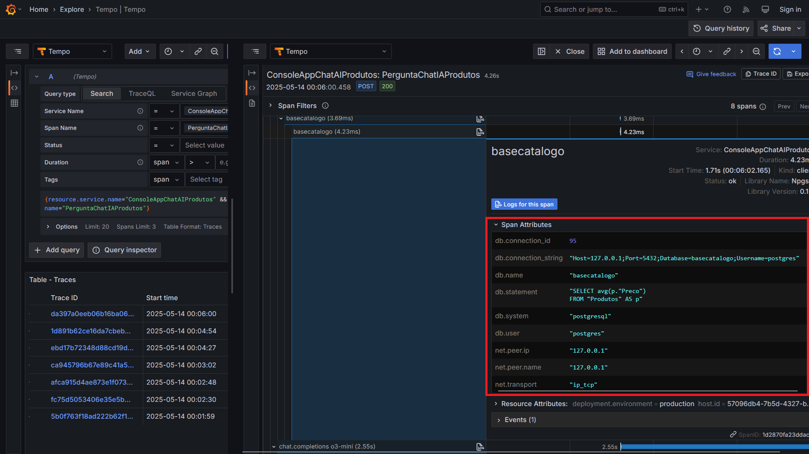
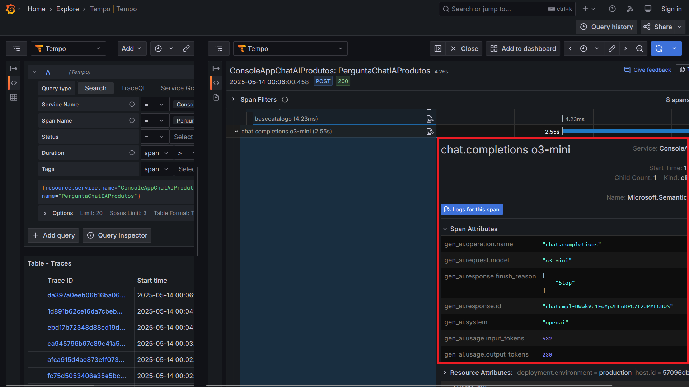

# dotnet9-semantickernel-postgres-otel-grafana_consultaprodutos
Exemplo em .NET 9 de Console Application que faz uso do projeto Semantic Kernel, com integração com soluções de IA como Azure Open AI e Ollama na consulta de informações de produtos em uma base PostgreSQL. Inclui Docker Compose para criação do ambiente de testes com os dados + monitoramento com Grafana e OpenTelemetry.

O exemplo já faz uso do Grafana Alloy para a coleta de traces. Para saber mais sobre o Alloy acesse:
- https://grafana.com/docs/alloy/latest/
- https://github.com/grafana/grafana-opentelemetry-dotnet

---

## Resultados da Telemetria

Trace gerado:

O mesmo trace com a consulta à base de dados:

E exibindo o detalhamento do consumo de tokens (em testes com o Azure OpenAI):

